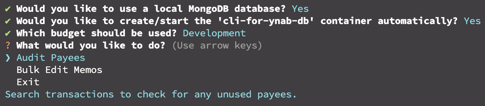

# CLI for YNAB

A CLI tool for various YNAB functions not supported by the web app.



# Usage

## Functions

- Audit Payees: Look for any unused payees to clean up your payee list.
- Bulk Edit Memos: Edit one or more transaction memos at once. Search by existing memo, payee, or date and prepend, append, or overwrite memos.

## Prerequisites

1. Have a YNAB [personal access token](https://api.ynab.com/#personal-access-tokens).
   - You can set this in your environment variables as `YNAB_TOKEN`, otherwise the app will prompt for it.
2. Install Node v23.

## MongoDB Backend (preferred)

Using this tool with a local MongoDB backend allows for quicker tasks as data is saved locally rather than retrieved from YNAB on every request.

To use a MongoDB backend:

1. [Install Docker](https://www.docker.com/get-started/).
2. Run `npm run start`.
3. Answer _yes_ to "Would you like to use a local MongoDB database?"
4. Answer _yes_ to "Would you like to create/start the 'cli-for-ynab-db' container automatically?"

If you would like to manually manage the container:

1. Create the container:

```bash
docker run --detach \
    --name cli-for-ynab-db \
    --volume cli-for-ynab-db:/data/db \
    --publish 27017:27017 \
    mongo:8
```

2. Use `docker container start cli-for-ynab-db` to start the container, once created.
3. Use `docker container stop cli-for-ynab-db` to stop the container, once created.

## No Database

> **ℹ️** This may result in slower performance and potential rate limiting by YNAB.

Make sure to select _no_ when prompted to use local MongoDB storage.

# Roadmap

- [ ] Create [Inquirer](https://github.com/SBoudrias/Inquirer.js) date prompt
- [ ] Add currency conversion
